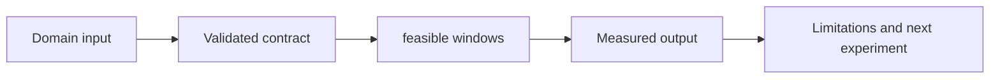

# Grid Carbon Intelligence

[](https://github.com/vipul957/grid-carbon-intelligence/actions/workflows/quality.yml) [](LICENSE)

> **Grid Carbon Intelligence** is a carbon-aware workload scheduling and grid-intensity analytics toolkit.

## Start here

**In one sentence:** Choose lower-carbon workload windows while respecting duration and deadline constraints.

| If you want to... | Open this first |
|---|---|
| Understand the method | [`src/grid_carbon_intelligence/scheduler.py`](src/grid_carbon_intelligence/scheduler.py) |
| See the second reusable utility | [`src/grid_carbon_intelligence/constraints.py`](src/grid_carbon_intelligence/constraints.py) |
| Run a tiny example | [`examples/quick_demo.py`](examples/quick_demo.py) |
| Understand the next milestone | [`docs/ROADMAP.md`](docs/ROADMAP.md) |
| Check correctness | [`tests/`](tests/) and the CI badge above |

### System flow



### What is implemented now

The repository currently contains a dependency-light, deterministic baseline with tests. It is intentionally small enough to inspect line by line. The next research layer should preserve the same input contract and evaluation protocol rather than replacing the baseline with an opaque demo.


## Problem statement

Choose feasible execution windows that reduce emissions without violating duration or deadline constraints.

The central mathematical object is **min mean(grid_intensity[window]) subject to duration and deadline**. The current implementation keeps this object small and testable so that later deep-learning improvements can be compared with an auditable baseline.

## Data contract

Expected input: **timestamped grams CO2e/kWh plus workload kWh, duration, deadline, and optional price**. Every adapter must document units, provenance, timezone, missing values, licensing, and information available at prediction time. Synthetic examples test the software contract; they are not domain evidence.

## Baseline and assumptions

The first method is **rolling-window optimization followed by multi-objective carbon/cost scheduling**. It assumes correctly timestamped observations and a stable evaluation definition. A future model must preserve the split logic and report improvement over this baseline rather than only reporting an absolute score.

## Evaluation protocol

Report **avoided grams CO2e, delay, cost, renewable share, constraint violations**. Include performance by regime, calibration or uncertainty quality where applicable, compute cost, and known failure cases. Never tune repeatedly on the final test set.

## Next research milestone

**Add price/carbon Pareto frontiers and a simulator for batch GPU workloads.**

## Research status

This repository is a documented baseline and extensible source scaffold. Results are experimental until validated on a licensed, representative dataset. No proprietary data, employment claim, endorsement, or company affiliation is implied.

## Architecture

The project separates domain formulation, data contracts, deterministic baselines, model implementations, evaluation, and deployment concerns. `src/` contains importable utilities, `tests/` contains fast contract tests, `examples/` contains runnable synthetic demonstrations, and `docs/ROADMAP.md` describes the next research stages.

## Reproducibility contract

Any future experiment must record dataset provenance and license, units and timezone, sampling interval, missing-value policy, split logic, random seeds, software versions, compute environment, and known limitations. Preprocessing must be fitted only on training data. Temporal problems require chronological or group-aware splits.

## Quick start

```bash
python -m venv .venv
source .venv/bin/activate
pip install -e .
pytest -q
python examples/quick_demo.py
```

## Engineering standards

The repository includes GitHub Actions CI, MIT licensing, contribution and security guidance, issue and pull-request templates, and monthly Dependabot updates. A model card should be added before presenting domain results as decision-ready.

## Limitations

The baseline is not production-ready. Real deployment requires external validation, monitoring, access controls, incident response, and review by subject-matter experts.

## References

[1]: https://scikit-learn.org/stable/modules/model_evaluation.html "Scikit-learn model evaluation"
[2]: https://pytorch.org/docs/stable/index.html "PyTorch documentation"
